**Лабораторная работа №2**
==========================
*Задание 1 (Установка ОС и настройка LVM, RAID)*
-------------------------------------------------
1. Я создаю виртуальную машину, выдав ей следующие характеристики: 

* 1 gb ram
* 1 cpu
* 2 hdd - ssd1 и ssd2, с равным размером и возможностью горячей замены
* SATA контроллер настроен на 4 порта

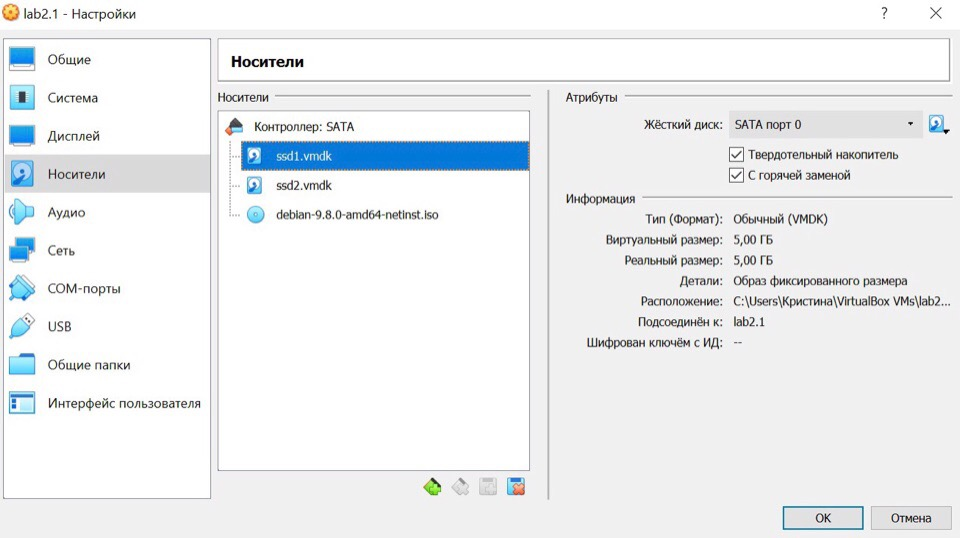

2. Далее нужно добавить и настроить RAID и LVM, чтобы конечный результат получился таким:

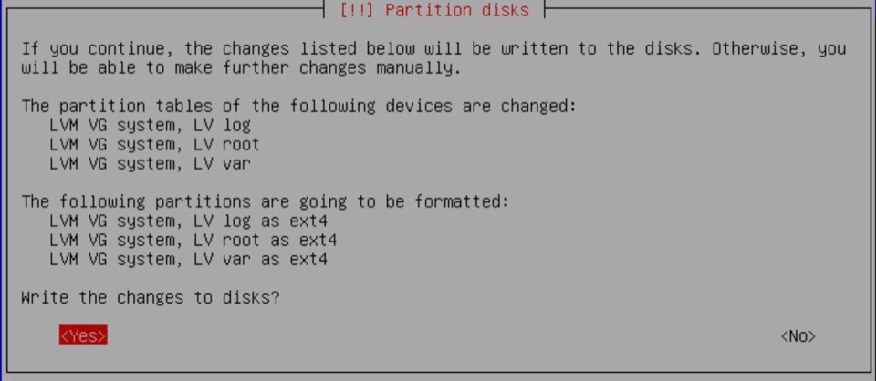

3. Устанавливаем  grub на первое устройство, загружаем систему и копируем раздел /boot с sda на sdb, с помощью `dd if=/dev/sda1 of=/dev/sdb1`:

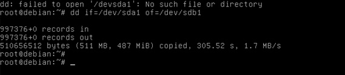

4. Просматриваем диски в системе `lsblk`, получается два hdd диска - sda и sdb:

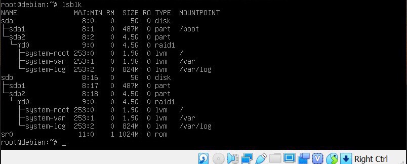

5. Устанавливаем grub на второе устройство `grub-install /dev/sdb` и с помощью `cat /proc/mdstat` просматриваем, что RAID-массив проинициализирован корректно, так как в этом файле отражается его текущее состояние:
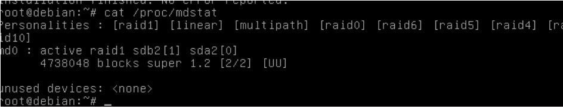

Также с помощью некоторых команд можно узнать: 
* pvs - информацию о физическом томе;
* lvs - информацию о логическом томе;
* vgs - информацию о группе физических томов;
* mount - просмотр примонтированных устройств.

***Результат проделанного задания - я создала виртуальную машину с двумя дисками, настроила LVM и RAID.***

Задание 2 (Эмуляция отказа одного из дисков)
--------------------------------------------

1. Так как я поставила галочку в hot swap, то мне доступно удаление дисков на лету. Поэтому я удаляю диск ssd1 из свойств машины и все файлы связанные с ним (ssd1.vmdk). С помощью перезагрузки нужно убедиться, что все работает. 

2. Проверяю статус RAID-массива при помощи `cat /proc/mdstat`:
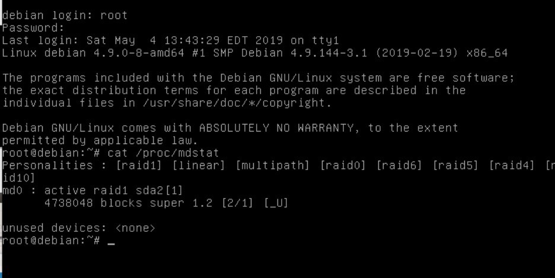

3. Добавляю новый диск ssd3 такого же размера.

4. С помощью команды `fdisk -l` проверяю, что новый диск приехал:
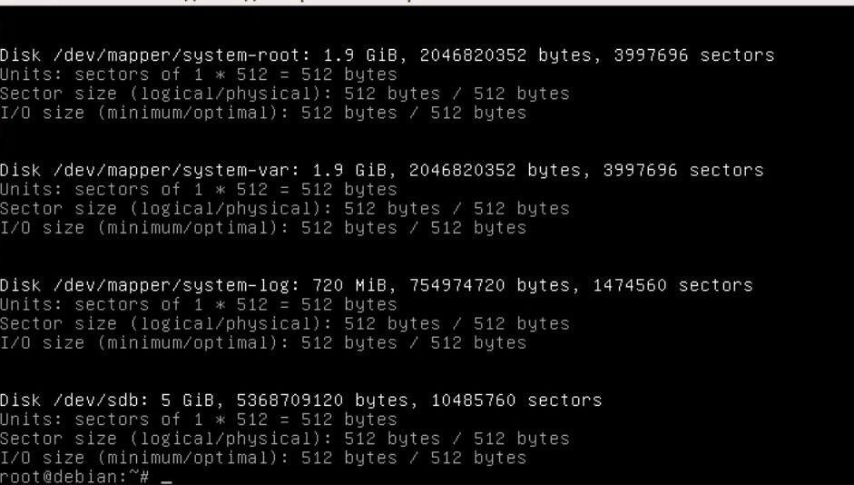

5. Копирую таблицу разделов со старого диска на новый при помощи  `sfdisk -d /dev/sda | sfdisk /dev/sdb`:
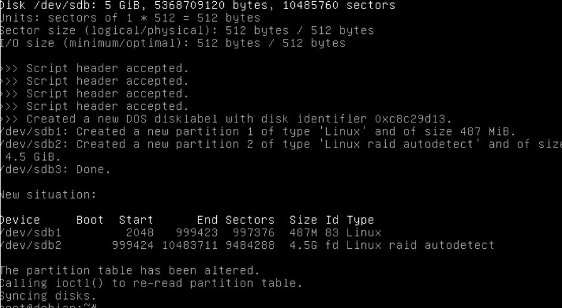

6. Просматриваю результат при помощи команды fdisk -l:
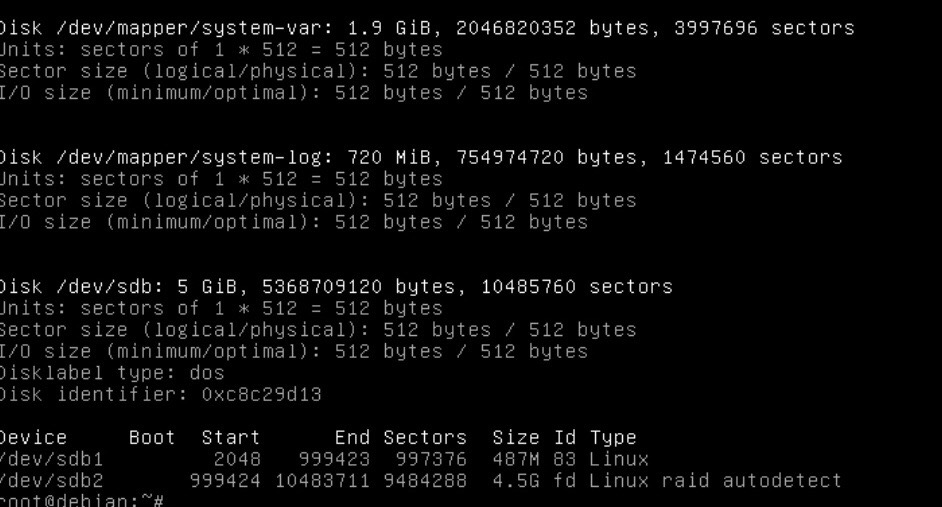

7. Добавляю в RAID-массив новый диск при помощи  `mdadm -manage /dev/md0 -add /dev/sdb` и просматриваю результат  `cat /proc/mdstat`:
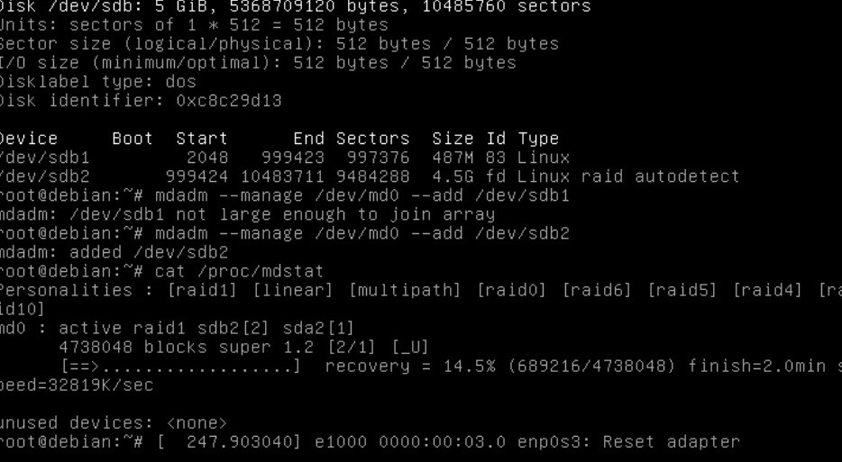

8. Теперь я вручную выполняю синхронизацию разделов, которые не входят в RAID. Для этого я использую утилиту dd, которая выполняет копирование данных из одного места в другое. Копируем с "живого" диска на новый.  `dd if=/dev/sda1 of=/dev/sdb1`:
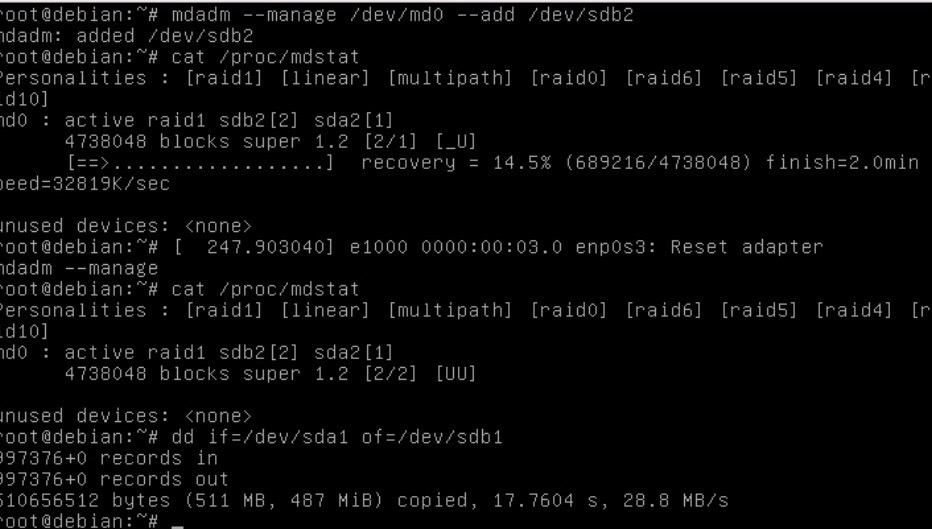

9. Выполняю перезагрузку, чтобы убедиться, что все работает.

***Результат проделанного задания - я проэмулировала отказ одного из дисков, сохранила диск ssd2 и добавила новый диск ssd3***

Задание 3 (~~жесть~~Добавление новых дисков и перенос раздела)
---------------------------------------------------------------
1. Проэмулирую отказ диска ssd2, удаляю все из свойств машины и перезагружаюсь, с помощью lsblk -o просматриваю что получилось:

2. Добавляю новый диск ssd4 и смотрю что произошло  `lsblk -o`:

3. Так как все может полететь к чертям, то на этот раз данные буду переносить с помощью LVM. Поэтому копируем файловую таблицу со старого диска на новый `sfdisk -d /dev/sda | sfdisk /dev.sdb`:

4. Теперь выполняю команду  `lsblk -o` и замечаю, что по сравнению с прошлым выводом данной команды, сейчас на новом диске sdb появились разделы sdb1 и sdb2. А далее копирую данные /boot на новый диск  `dd if=/dev/sda1 of=/dev/sdb1`:

5. Устанавливаю загрузчик на новый диск  `grub-install /dev/sdb` потому что он загружает ОС и этот загрузчик нужен на новом диске после удаления старого, без него ничего не получится. После этого создаю рейд-массив с включением туда только одного нового ssd диска  `mdadm --level=1 --raid-devices=1 /dev/sdb2` и с помощью команды `cat /proc/mdstat` проверяю, что  установлен новый RAID-массив md63:

6. Настройка Logical Volume Manager. Создаю новый физический том и включаю в него недавно созданный RAID-массив `pvcreate /dev/md63` и проверяю это все командой `lsbls -o`:

7. При выполнении LV var, log, root видим, что находятся они на физическом диске sda:

8. Теперь нужно выполнить перемещение данный со старого диска на новый `pvmove -i 10 -n /dev/system/root /dev/md0 /dev/md63`:

9. Далее надо проверить все ли данные ходятся на одном диске, делаю это при помощи `lvs -a -o+devices` и `lsblk -o`:

10. Изменяю Volume Group, удаляя из него диск старого raid и обязательно проверяю что раздел /boot не пустой:

11. 
